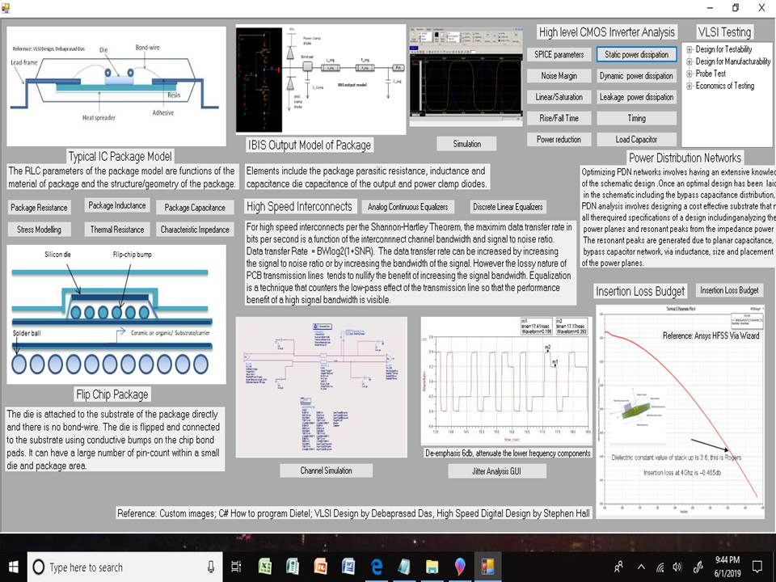

# IC Package Design to Board Design 

The project provides a graphical user interface displaying technical knowledge ranging from IC package design to board design. 
To download the executable please click on https://github.com/alpaddesai/ICPackageDesign/releases

 

