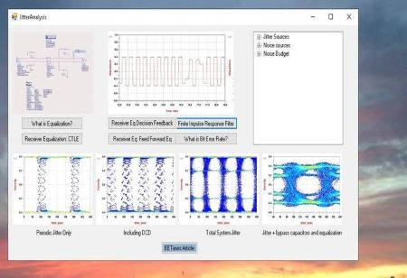

# Integrated Circuit Package Design to Board Design 

The project provides a graphical user interface displaying technical knowledge ranging from IC package design to board design. 
To download the executable please click on https://github.com/alpaddesai/ICPackageDesign/releases

Company confidential information is not displayed. All images are either custom by Alpa D Desai or a reference name is included.Most of the images are custom. 

### IC package design
 

Addiitional reference: https://github.com/alpaddesai/ArchitecturalProductDesign
